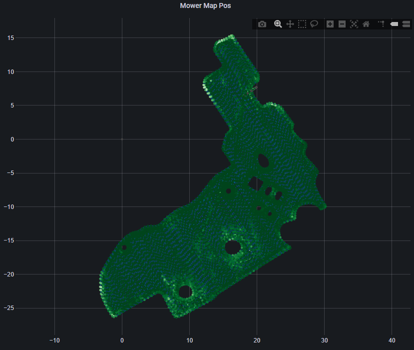
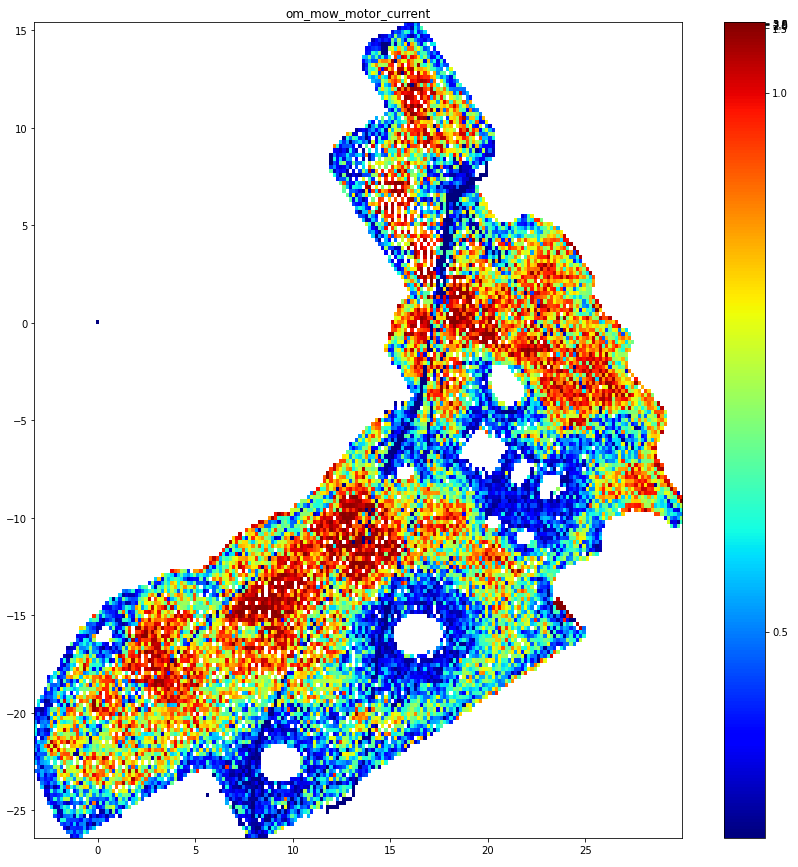
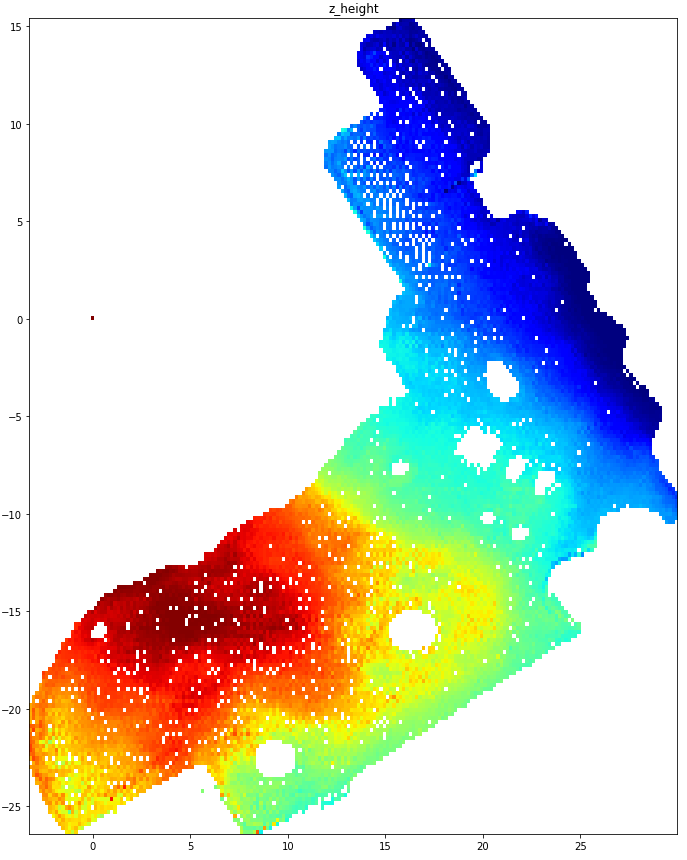

# Nodes for the xbot_monitoring package
Various nodes that report data via MQTT

copy the scripts to `open_mower_ros\src\lib\xbot_monitoring\src\`

Add following to `open_mower_ros\src\open_mower\launch\open_mower.launch`
Modify type and name according to the needed sensor.

```
<node pkg="xbot_monitoring" type="xbot_sensor_acceleration.py" name="xbot_sensor_acceleration" output="screen" respawn="true" respawn_delay="10"/>
```

# Visualisation examples
The generated sensor data is stored in an influx database

## Grafana with plotly plugin
quick visualisation for few datapoints.


## python matplotlib and datashader
long term statistics





